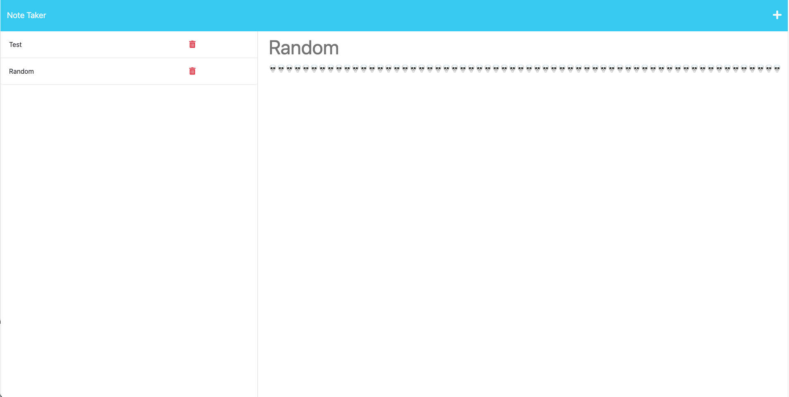
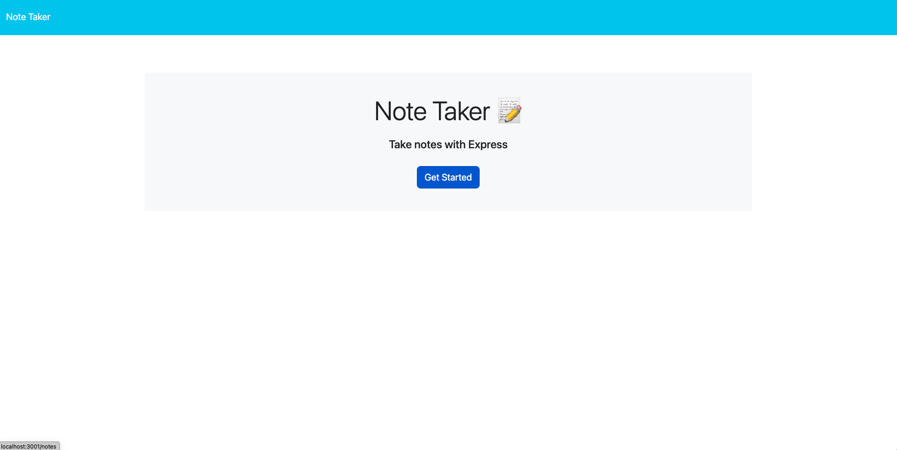

# Express.js: Note Taker

Note Taker

## Description

This project was to demonstrate to use backend and frontend. Using Node js and Express js, we were able to conenct the front and back end to work together to store client note's that they submit.

## Usage

In the server.js file, we needed to connect the front end with the server in order to see the second html page called notes.html. From there, I needed to make sure the notes the client adds to the server is stored without local storage. I used express js notation and node js to make sure the server works and runs properly. From there, I deployed the application in heroku.

Source / Credits :

Website URL!!
